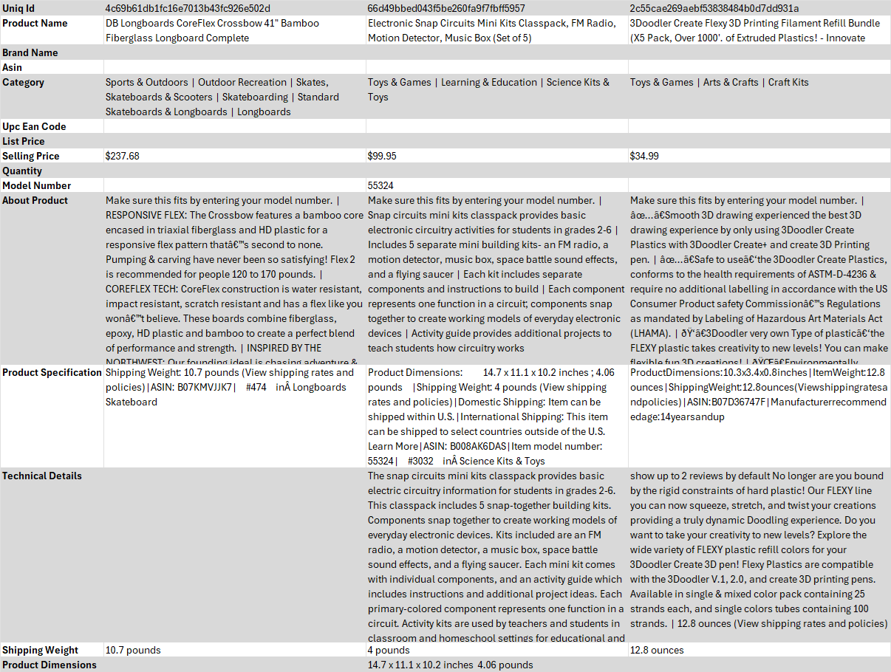
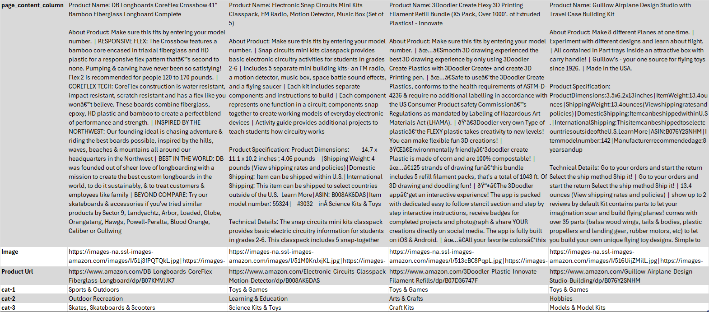

# E-commerce Chatbot

In the rapidly evolving world of e-commerce, providing exceptional customer service and personalized shopping experiences is crucial. One effective way to achieve this is through the integration of intelligent chatbots. However, building a chatbot that can effectively handle both structured and unstructured data is a complex challenge.

## Dataset

The dataset utilized in this project is the [Amazon Product Dataset 2020](https://www.kaggle.com/datasets/promptcloud/amazon-product-dataset-2020?resource=download) from **Kaggle**. This comprehensive dataset includes extensive information on a wide array of products available on Amazon, encompassing product titles, descriptions, and additional pertinent details.

Here is a preview of the raw data:



This dataset consists of 10,000 rows and includes more than 20 columns including:

- **Product Name**: The name of the product.
- **Category**: The hierarchical category information of the product, detailing both main and subcategories.
- **Selling Price**: The price at which the product is being sold.
- **About Product**: A brief description or highlights of the product.
- **Product Specification**: Detailed specifications of the product.
- **Technical Details**: Technical information and features of the product.
- **Product URL**: The URL linking to the product's page on Amazon.

The **Category** column details the product's classification from broad to specific, separated by a `|`. An example of a category entry is:

```
Sports & Outdoors | Outdoor Recreation | Skates, Skateboards & Scooters | Skateboarding | Standard Skateboards & Longboards | Longboards
```

This structure allows us to understand the product's placement within Amazon's hierarchy, aiding in the structured analysis and organization of the data for our chatbot's functionality.

## Data Pre-processing

For our chatbot with Retrieval-Augmented Generation (RAG), it's essential to organize the product data based on their hierarchical categories. During the pre-processing phase, we systematically extract the main category, subcategory, and tertiary category for each product. These categories are then stored in separate columns: `cat-1` for the main category, `cat-2` for the subcategory, and `cat-3` for the tertiary category.

Additionally, we consolidate relevant text data from different fields into a single column. This involves merging columns such as *Product Name*, *About Product*, and *Product Specification* into one comprehensive column named `page_content_column`. This consolidated text data will be utilized later by the LangChain DataLoader as the main content column.

Below is a preview of how the processed data looks:



This structured and consolidated data format enhances the chatbot's ability to accurately filter and retrieve product information, ensuring a seamless and efficient user experience.

## Chatbot

Helping customers find products that meet their requirements from a catalog of over 10,000 items is a complex task. Although e-commerce databases have well-defined structures, they also contain a vast amount of unstructured text information. Integrating an intelligent chatbot to navigate this mix of structured and unstructured data is key to enhancing customer experience. However, developing such a chatbot that can manage and utilize both types of data effectively is a significant challenge.

To tackle this, we employ a multi-step approach:

- **Step 1: Data Filtering with LLM** - We utilize a Large Language Model (LLM) to initially filter the vast dataset. The LLM helps in narrowing down the product information by understanding and processing the unstructured text data.

- **Step 2: Relevant Data Extraction with RAG** - The pre-filtered data is then processed through a Retrieval-Augmented Generation (RAG) architecture. This setup is designed to extract the most relevant data points and generate accurate and contextually appropriate responses.

Our experiments indicate that using RAG alone on unstructured data often leads to inaccurate and random responses. However, when the data is pre-filtered using an LLM, the results are significantly more deterministic and consistent. This two-step approach ensures that the chatbot provides precise and helpful product recommendations to the customers, enhancing their shopping experience.

## Example

### User's Question:
"Do you have a bike for my 3-year-old son?"

### Step 1: Filtering Process

The chatbot begins by filtering through the structured data to identify relevant product categories and subcategories.

**Filtering Results:**

1. **Level 1: Broad Categories**
   - **Related Categories:** `['Toys & Games', 'Baby Products']`
   - **Number of Records:** `6876`

2. **Level 2: Narrower Categories**
   - **Related Categories:** `['Tricycles, Scooters & Wagons', 'Sports & Outdoor Play']`
   - **Number of Records:** `476`

3. **Level 3: Specific Categories**
   - **Related Categories:** `['Balance Bikes', 'Ride-On Toys & Accessories']`
   - **Number of Records:** `48`

### Step 2: Finding Relevant Products and Providing an Answer

After filtering, the chatbot identifies the most relevant products that match the user’s query and provides a detailed response.

**Product Recommendation:**

```markdown
Yes, I recommend the **FirstBIKE Limited Bike with Brake, Yellow**. It's designed for children aged 24 months to 5 years, making it suitable for your 3-year-old son. This balance bike features a lightweight frame, a child-friendly rear drum brake, and a unique design that helps develop balance and motor skills.

- **Product Name:** FirstBIKE Limited Bike with Brake, Yellow
- **Product URL:** [FirstBIKE Limited Bike with Brake, Yellow](https://www.amazon.com/FirstBIKE-Limited-Bike-Brake-Yellow/dp/B0716JNHBX)
- **Price:** $130.03

If you need more options or specific features, let me know!
```

In this example, the chatbot effectively narrows down the product selection from broad categories to specific items, ensuring the user receives a relevant and precise product recommendation based on the structured data.
